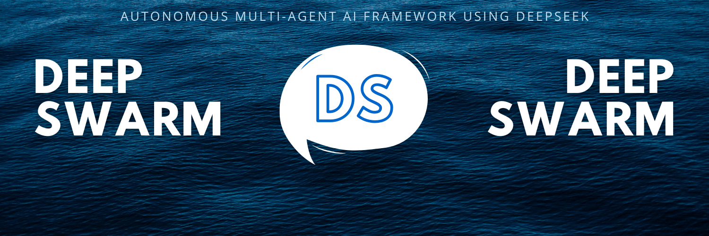

# SeekSwarm.js (Node.js Framework for OpenAI Multi-Agent Systems)

**SeekSwarm.js** is a lightweight Node.js framework for orchestrating multi-agent systems using OpenAI’s API. It offers developers an intuitive way to manage and coordinate agent-based workflows, enabling scalable applications for real-world scenarios.

> **Important Note**  
> **SeekSwarm.js** is an experimental framework designed for educational and prototyping purposes. It is not intended for production environments and lacks official support. This framework adapts OpenAI’s Python-based [Swarm framework](https://cookbook.openai.com/examples/orchestrating_agents) to Node.js.

## Installation

Install SeekSwarm.js via npm:

```bash
npm install openai-swarm-node
```

## What is SeekSwarm.js?

**SeekSwarm.js** enables the creation and management of multi-agent systems, focusing on task delegation, handoffs, and execution. Inspired by OpenAI’s Swarm framework, this Node.js adaptation provides a powerful and user-friendly interface to build customizable and scalable agent workflows.

The framework leverages OpenAI’s Chat Completions API for defining agents and their interactions, making it an ideal choice for projects requiring distributed coordination.

> **Note**  
> SeekSwarm.js agents are stateless between API calls, ensuring simplicity and modularity. This design aligns with OpenAI’s principles for agent-based systems.

## Usage

With SeekSwarm.js, defining agents and orchestrating tasks between them is simple. Below is an example showcasing how to set up and manage two agents.

```javascript
const { SeekSwarm, Agent } = require('openai-swarm-node');

// Define two agents
const agentA = new Agent({
    name: "Agent A",
    instructions: "You are a helpful agent.",
    tools: [
        {
            name: 'transferToAgentB',
            fn: () => agentB,
        },
    ],
});

const agentB = new Agent({
    name: "Agent B",
    instructions: "Only speak in Haikus.",
});

const swarm = new SeekSwarm(process.env.OPENAI_API_KEY);

// Run conversation with agentA
(async () => {
    const response = await swarm.run({
        agent: agentA,
        messages: [{ role: "user", content: "I want to talk to agent B." }]
    });

    console.log(response.messages.pop().content);
})();
```

```
Hope glimmers brightly,  
New paths converge gracefully,  
What can I assist?  
```

## Table of Contents

- [Overview](#overview)
- [Examples](#examples)
- [Documentation](#documentation)
  - [Running SeekSwarm](#running-seekswarm)
  - [Agents](#agents)
  - [Functions](#functions)
  - [Streaming](#streaming)
- [Evaluations](#evaluations)
- [Utils](#utils)

## Overview

SeekSwarm.js provides a Node.js-based implementation of OpenAI’s **Swarm framework**, allowing developers to create lightweight, multi-agent systems with ease. By facilitating task delegation and inter-agent communication, it simplifies the process of building complex workflows.

### Why SeekSwarm.js?

SeekSwarm.js is an excellent choice for:

- Developers exploring multi-agent systems in a Node.js environment.
- Prototyping workflows involving distributed tasks and coordination.
- Educational purposes and small-scale experiments.

## Examples

Check out the `/examples` folder for practical demonstrations. Each example includes a README explaining its implementation.

- [`basic`](examples/basic): Learn agent setup, task delegation, and handoffs.
- [`triage_agent`](examples/triage_agent): Implement a triage system that delegates tasks to the appropriate agent.
- [`airline`](examples/airline): Handle customer service workflows in the airline industry.
- [`support_bot`](examples/support_bot): Build a networked customer service bot.

## Documentation

### Running SeekSwarm.js

Start by creating a SeekSwarm client to interact with OpenAI’s API.

```javascript
const { SeekSwarm } = require('openai-swarm-node');

const client = new SeekSwarm(process.env.OPENAI_API_KEY);
```

### `client.run()`

The `run()` method orchestrates conversations between agents, enabling features like function execution, handoffs, and multi-turn dialogues.

#### Arguments

| Argument              | Type     | Description                                                                                                                                            | Default    |
|-----------------------|----------|--------------------------------------------------------------------------------------------------------------------------------------------------------|------------|
| **agent**             | `Agent`  | The initial agent handling the conversation.                                                                                                          | Required   |
| **messages**          | `Array`  | A list of messages (similar to [OpenAI Chat API messages](https://platform.openai.com/docs/api-reference/chat/create#chat-create-messages)).          | Required   |
| **contextVariables**  | `Object` | Additional context variables accessible to agents.                                                                                                     | `{}`       |
| **maxTurns**          | `Number` | Maximum conversational turns before returning a result.                                                                                               | `Infinity` |
| **debug**             | `Boolean`| Enable debug logging.                                                                                                                                 | `false`    |

#### Response Fields

| Field                 | Type     | Description                                                                                                                                             |
|-----------------------|----------|---------------------------------------------------------------------------------------------------------------------------------------------------------|
| **messages**          | `Array`  | The list of generated messages.                                                                                                                         |
| **agent**             | `Agent`  | The agent that last handled the conversation.                                                                                                           |
| **contextVariables**  | `Object` | Updated context variables after the conversation.                                                                                                       |

### Agents

Agents define instructions and functions (tools) to drive conversations and task execution.

```javascript
const agentA = new Agent({
  name: "Agent A",
  instructions: "You are a helpful agent.",
});
```

### Functions

Functions allow agents to perform tasks such as data retrieval, processing, or transferring control to another agent.

```javascript
const transferToAgentB = () => agentB;

const agentA = new Agent({
  name: "Agent A",
  instructions: "You are a helpful agent.",
  tools: [{ name: 'transferToAgentB', fn: transferToAgentB }],
});
```

### Handoffs and Context Variables

Agents can transfer tasks or update `contextVariables` to handle complex workflows.

```javascript
const salesAgent = new Agent({ name: "Sales Agent" });

const agent = new Agent({
  functions: [
    () => new Result({ agent: salesAgent, contextVariables: { department: "sales" } }),
  ],
});
```

### Function Schemas

Functions are automatically converted to JSON schemas, enabling seamless interaction with OpenAI’s API.

```javascript
function lookUpItem(searchQuery) {
    /**
     * @description Search for item ID using keywords or descriptions.
     * @param {string} searchQuery - Description or keywords to search for the item.
     * @returns {string} - Found item ID.
     */

    return console.log(`Searching for item: ${searchQuery}`);
}
```

## Streaming

SeekSwarm.js supports real-time streaming of agent responses.

```javascript
const stream = client.run({ agent, messages, stream: true });
for await (const chunk of stream) {
    console.log(chunk);
}
```

## Evaluations

You can test and validate your multi-agent systems using built-in evaluation tools. Check the `/examples` directory for more details.

## Utils

Use the `run_demo_loop` utility to interactively test agents in a REPL environment.

```javascript
const { run_demo_loop } = require('openai-swarm-node/utils');

run_demo_loop(agent);
```

---

### Core Contributors

- Pulkit Garg (Node.js adaptation)
- OpenAI (original Python framework)
